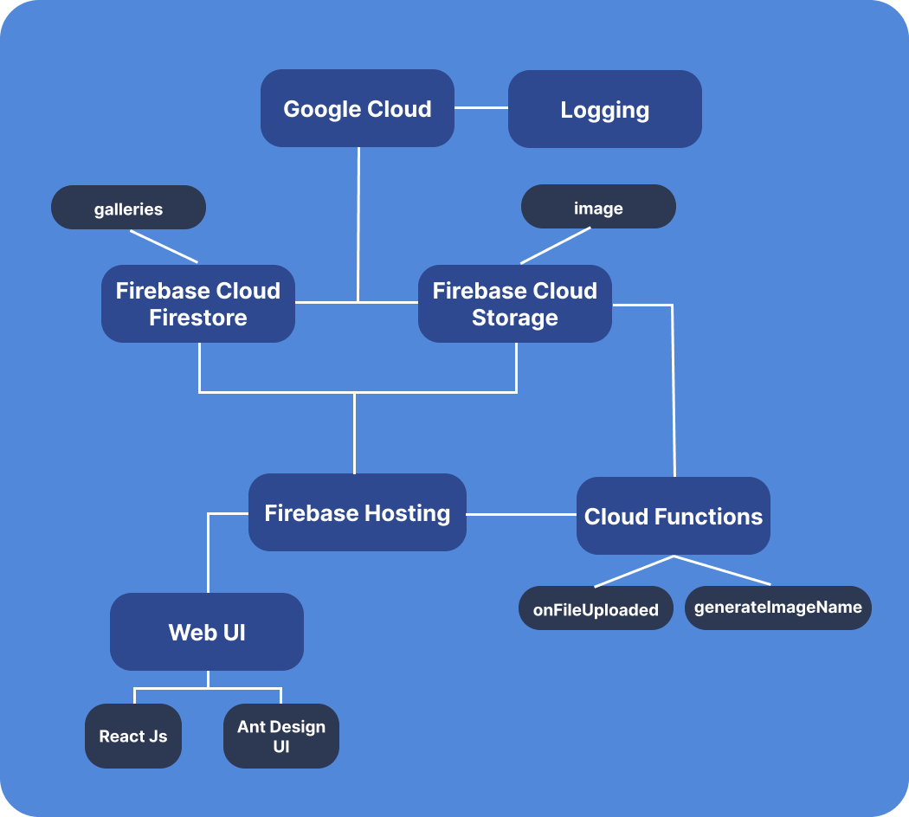

## About
This is a demonstration of a Gallery media platform where you can add new photos and comment the photos.

## Architecture

## Demo
https://live-demo-firebase.web.app/

## Tech Stacks
- React Js
- Ant Design UI
- Firebae Hosting
- Google Cloud Storage
- Firebase Cloud Functions

## Available Scripts

In the project directory, you can run:

## Installing Dependancies
### `npm install`

Install all dependancies for Web

### `cd functions && npm install`

Install all dependancies for Cloud functions

### `npm start`

Runs the app in the development mode. 
Open [http://localhost:3000](http://localhost:3000) to view it in the browser.

## Web Building
### `npm run build`

Builds the app for production to the `build` folder. 
It correctly bundles React in production mode and optimizes the build for the best performance.

The build is minified and the filenames include the hashes. 
Your app is ready to be deployed!

## Deployment
### `firebase deploy`

This will deploy Web on `build` folder and functions source code to the firebase cloud functions